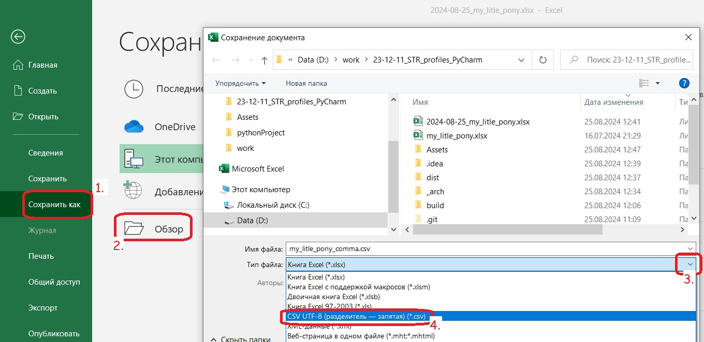
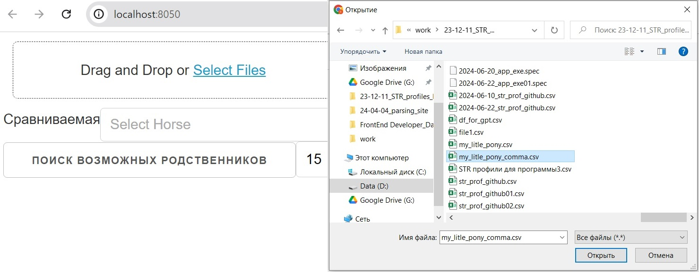
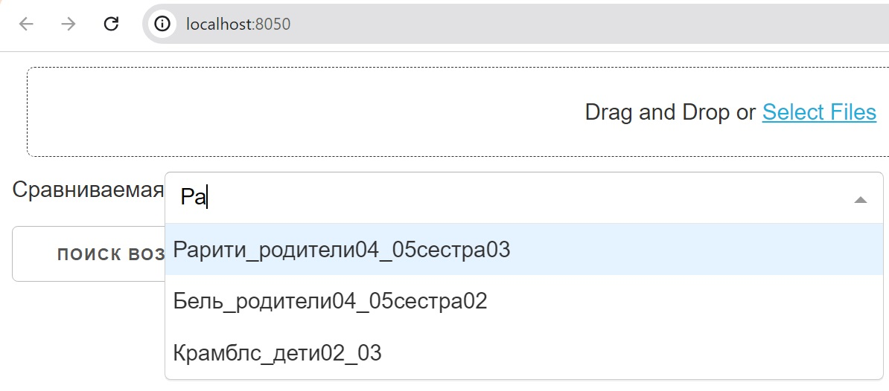
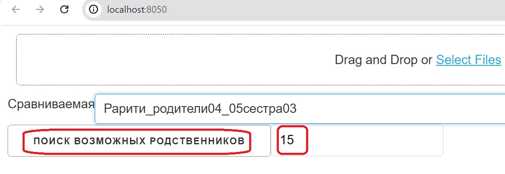
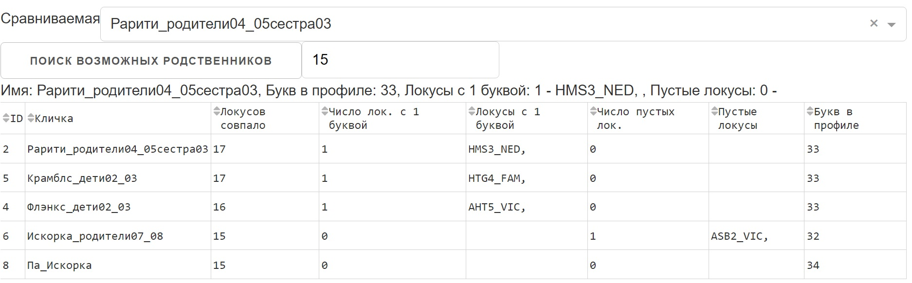

## Программа find_1-horse.exe

Данная программа предназначена для работы с генетической информацией о лошадях. Для начала работы выполните следующие шаги:

1. Подготовьте таблицу базы данных из "*.xlsx" в "*.csv": 1.Сохранить как -> 2.Обзор -> 3.Выбор типа файла -> 4.Выбрать тип файла "CSV UTF-8(разделитель-запятая)(*.csv) -> Сохранить базу данных в формате "*.csv" 
- 
2. Запустите исполняемый файл `find_1-horse.exe` из папки `\dist\find_1-horse` (если не запускается, то все в архиве`\dist\find_1-horse.rar'`).
2. После открытия страницы в браузере нажмите на кнопку "Select Files" и выберите базу данных
с генетической информацией о лошадях (34 буквы, 17 локусов).
- 
3. Выберите требуемую лошадь в поле "Сравниваемое". 
- 
4. Укажите количество необходимых совпадений в локусах.
4. Нажмите на кнопку "Поиск" для поиска возможных родственников.
- 
5. После этого появится таблица со всеми совпадениями, где вы увидите количество совпадений локусов, частично отсутствующую информацию, локусы с полностью отсутствующей информацией и количество букв в профиле каждой лошади.
- 

