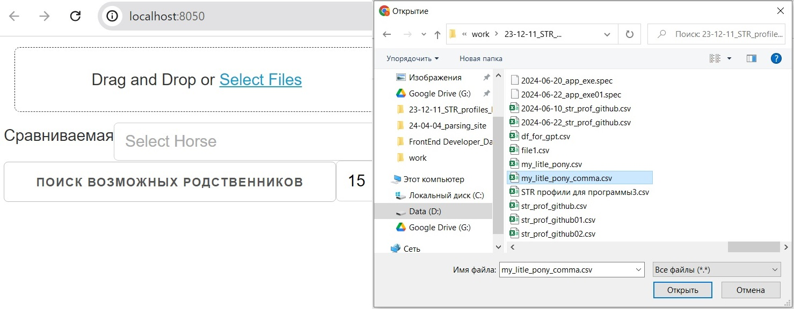
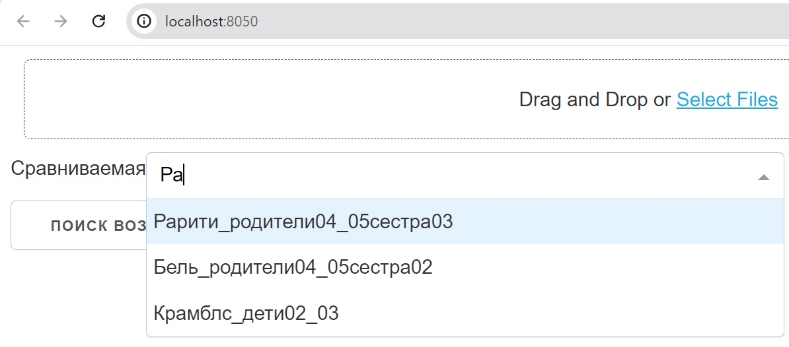
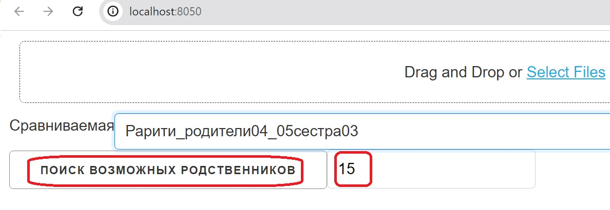
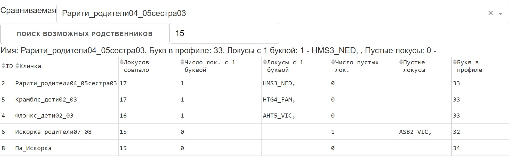

## Программа find_1-horse.exe

Данная программа предназначена для работы с генетической информацией о лошадях. Для начала работы выполните следующие шаги:

1. Запустите исполняемый файл `find_1-horse.exe` из папки `\dist\find_1-horse`.
2. После открытия страницы в браузере, нажмите на кнопку "Select Files" и выберите базу данных
с генетической информацией о лошадях (34 буквы, 17 локусов).
- 
3. Выберите требуемую лошадь в поле сравниваемое. 
- 
4. укажите количество необходимых совпадений в локусах.
4. Нажмите на кнопку "Поиск" для поиска возможных родственников.
- 
5. После этого появится таблица со всеми совпадениями, где вы увидите количество совпадений фокусов, частично отсутствующую информацию, фокусы с полностью отсутствующей информацией и количество букв в профиле каждой лошади.
- 

